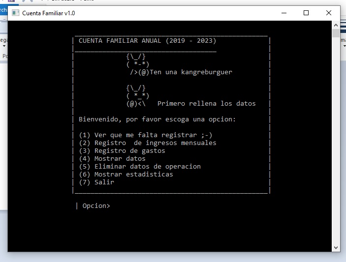

## Proyecto final de algorítmica  ciclo III     UNMSM 2019
* Autor: Johan valerio 

Funciones incluidas
* Ingresos Familiares
* Egresos Familiares
* Mostrar Datos (Ingresos y egresos)
* Eliminar datos
* Mostrar estadisticas de consumo familiar

#### IMPORTANTE
- Es un sistema de gasto familiar para 5 años, y su duracion se puede ampliar al gusto.
- IG: https://www.instagram.com/johan.mitma12
- Duracion estimada (2019-2024)

